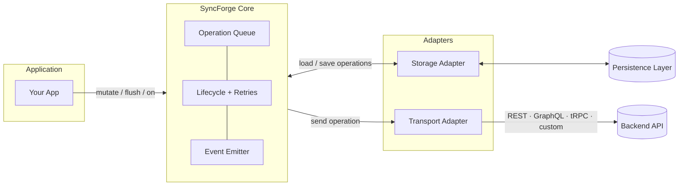
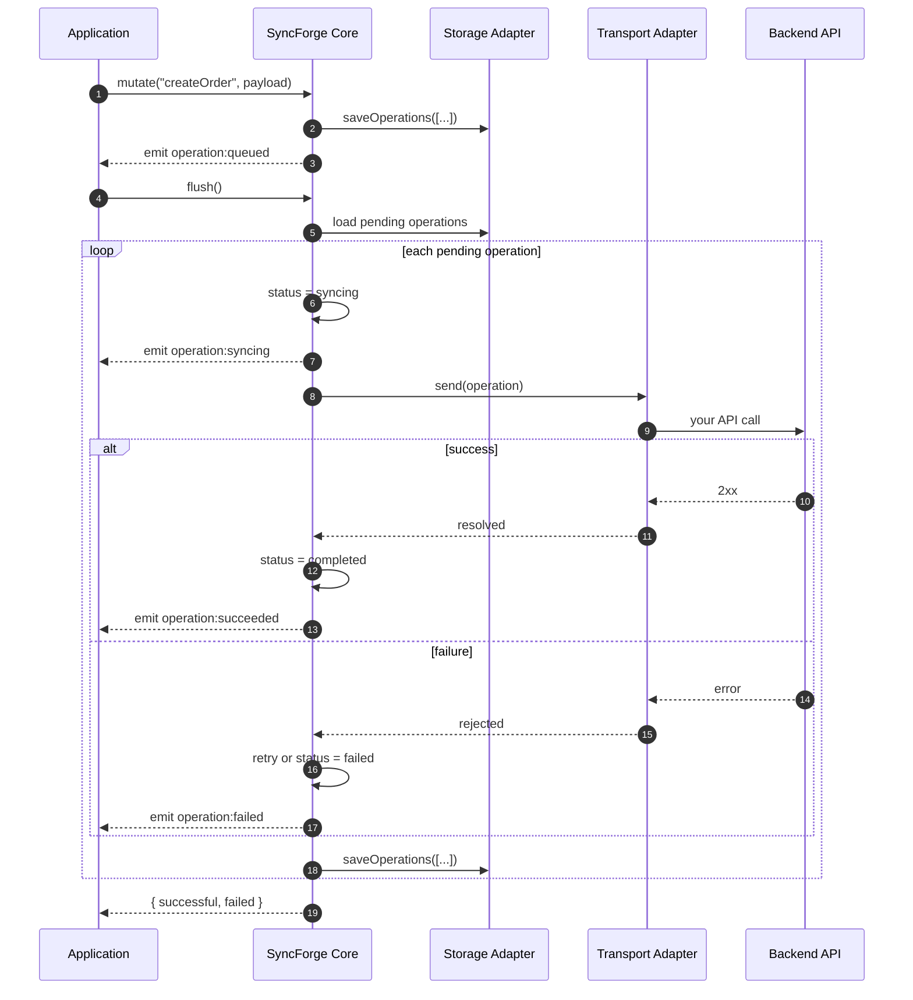
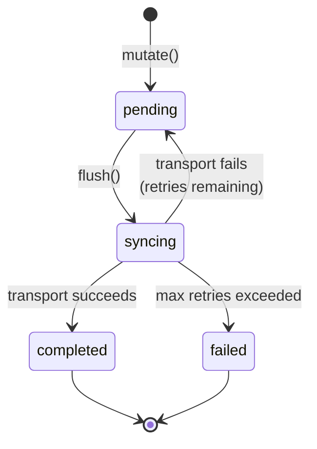

# SyncForge

**Don't lose user actions when the network drops.**

SyncForge aims to be the simplest way to guarantee mutation delivery in offline-capable applications without adopting a local database or replacing your existing API.

SyncForge is a small TypeScript library that saves changes locally when your app is offline or on a bad connection, then sends them to your server when you're back online. It works with any frontend framework and any backend — you bring your own API.

Using **React**? See [`syncforge-react`](./packages/react/README.md) — official provider and hooks (`useSyncEngine`, `useSyncFlush`, `useSyncStatus`) on top of the same engine.

Maintained by Frank K. Abrokwa ([@codewithcobby](https://github.com/codewithcobby))

## Table of contents

- [Project status](./README.md#project-status)
- [Installation](./README.md#installation)
- [React integration](./README.md#react-integration)
- [Quick start](./README.md#quick-start)
- [API reference](./README.md#api-reference)
- [The problem](./README.md#the-problem)
- [What SyncForge does](./README.md#what-syncforge-does)
- [Architecture](./README.md#architecture)
- [How it works](./README.md#how-it-works)
- [Lifecycle events](./README.md#lifecycle-events)
- [Why use SyncForge?](./README.md#why-use-syncforge)
- [Why not X?](./README.md#why-not-x)
- [What SyncForge is not](./README.md#what-syncforge-is-not)
- [Roadmap](./README.md#roadmap)
- [License](./README.md#license)

## Project status

SyncForge is currently in **active development**.

| Status              | Details                                                                                                                                                                               |
| ------------------- | ------------------------------------------------------------------------------------------------------------------------------------------------------------------------------------- |
| Implemented         | Mutation queue, transport adapter, memory & IndexedDB storage, auto sync on reconnect, retries, lifecycle events, optimistic updates, [`syncforge-react`](./packages/react/README.md) |
| Tested              | Core engine, IndexedDB persistence, auto sync, retry strategies, optimistic handlers, [`syncforge-react` hooks](./packages/react/README.md#hooks)                                     |
| Planned before v1.0 | Example ecosystem expansion                                                                                                                                                           |

## Installation

```bash
pnpm add syncforge
```

```bash
npm install syncforge
```

```bash
yarn add syncforge
```

### React

[`syncforge-react`](./packages/react/README.md) is a separate package — core `syncforge` has zero React dependencies.

```bash
pnpm add syncforge-react syncforge
```

```bash
npm install syncforge-react syncforge
```

Peer dependencies: `react`, `react-dom`, `syncforge`. Full setup, transport patterns, and hook reference: [**`syncforge-react` README**](./packages/react/README.md).

## React integration

Official React bindings live in [`syncforge-react`](./packages/react/README.md). Pass a pre-created engine to the provider; hooks subscribe to lifecycle events so you do not wire `useEffect` + `engine.on()` yourself.

```tsx
import { useMemo } from "react"
import { createIndexedDbStorage, createSyncEngine } from "syncforge"
import { SyncForgeProvider, useSyncEngine, useSyncFlush, useSyncStatus } from "syncforge-react"

const engine = createSyncEngine({
  storage: createIndexedDbStorage(),
  transport: myTransport,
  autoSync: true,
})

function App() {
  return (
    <SyncForgeProvider engine={engine}>
      <OrderForm />
      <SyncIndicator />
    </SyncForgeProvider>
  )
}

function SyncIndicator() {
  const status = useSyncStatus()
  return (
    <span>
      {status.pendingCount} pending{status.isSyncing ? " (syncing…)" : ""}
    </span>
  )
}

function OrderForm() {
  const engine = useSyncEngine()
  const flush = useSyncFlush()
  // engine.mutate(...) · flush() for manual sync
}
```

| Export                                                              | Description                                                       |
| ------------------------------------------------------------------- | ----------------------------------------------------------------- |
| [`SyncForgeProvider`](./packages/react/README.md#syncforgeprovider) | Share one `SyncEngine` via context (does not mutate the engine)   |
| [`useSyncEngine()`](./packages/react/README.md#usesyncengine)       | Raw `SyncEngine` reference — `mutate()`, `on()`, `engine.flush()` |
| [`useSyncFlush()`](./packages/react/README.md#usesyncflush)         | Optional tracked `flush()` for “Sync now” UI                      |
| [`useSyncMutate()`](./packages/react/README.md#usesyncmutate)       | Ergonomic `mutate()` with `optimisticData` and inline overrides   |
| [`useSyncStatus()`](./packages/react/README.md#usesyncstatus)       | `{ pendingCount, isSyncing, lastError }`                          |

**Docs:** [`packages/react/README.md`](./packages/react/README.md) · **Example:** [`examples/react-offline-orders`](./examples/react-offline-orders/) · **Try online:** [StackBlitz demo](https://stackblitz.com/github/codewithcobby/syncforge/tree/main/examples/react-offline-orders)

## Quick start

The first argument to `mutate()` is an **operation label** your app defines (e.g. `"createOrder"`). SyncForge stores it and passes the full operation to your transport on `flush()`. **Your transport** decides which API to call and how to map `operation.type` and `operation.payload`.

### API reference

#### `createSyncEngine(options?)`

| Option               | Type                                | Default                  | Description                                                                                        |
| -------------------- | ----------------------------------- | ------------------------ | -------------------------------------------------------------------------------------------------- |
| `transport`          | `TransportAdapter`                  | —                        | Sends each operation to your API. Required for `flush()` to work.                                  |
| `storage`            | `StorageAdapter`                    | `createMemoryStorage()`  | Persists the queue across reloads. Use `createIndexedDbStorage()` in browsers.                     |
| `retry`              | `RetryStrategy`                     | `immediateRetryStrategy` | Delay between retry attempts after a failed `send()`.                                              |
| `maxRetries`         | `number`                            | `3`                      | Max transport attempts per operation before status becomes `failed`.                               |
| `autoSync`           | `boolean`                           | `true`                   | Browser-only. Calls `flush()` on `window` `"online"`. Ignored in Node/SSR. Set `false` to disable. |
| `context`            | `TContext`                          | —                        | User-owned state (store, query client, etc.) passed to optimistic handlers.                        |
| `optimisticHandlers` | `Record<string, OptimisticHandler>` | —                        | Registry of `apply` / `rollback` handlers keyed by `operation.type`. Survives reload.              |

**`TransportAdapter`** — object with `send(operation: SyncOperation): Promise<void>`. Throw on failure to trigger a retry; resolve on success.

#### `SyncEngine` methods

| Method                            | Arguments                                                                  | Returns                           | Description                                                                                                                           |
| --------------------------------- | -------------------------------------------------------------------------- | --------------------------------- | ------------------------------------------------------------------------------------------------------------------------------------- |
| `mutate(type, payload, options?)` | `type`: `string` (your label), `payload`: any, `options?`: `MutateOptions` | `Promise<SyncOperation>`          | Enqueues a mutation. Runs optimistic `apply` after persist when handlers exist. Emits `operation:optimistic` then `operation:queued`. |
| `flush()`                         | —                                                                          | `Promise<{ successful, failed }>` | Sends all pending operations via `transport`. Requires `transport`.                                                                   |
| `getPending()`                    | —                                                                          | `Promise<SyncOperation[]>`        | Operations with status `pending`.                                                                                                     |
| `getFailed()`                     | —                                                                          | `Promise<SyncOperation[]>`        | Operations with status `failed` (terminal transport failure).                                                                         |
| `retry(id)`                       | `id`: `string`                                                             | `Promise<boolean>`                | Re-queue a failed operation (`pending`, `retries = 0`, clears `lastError`). Does not re-run `apply`.                                  |
| `retryAllFailed()`                | —                                                                          | `Promise<number>`                 | Re-queue all failed operations. Returns count of operations actually re-queued. Does not call `flush()`.                              |
| `compact()`                       | —                                                                          | `Promise<number>`                 | Remove all `completed` operations from storage. Preserves `pending`, `syncing`, and `failed`. Returns count removed.                  |
| `inspect(options?)`               | `options?`: `InspectOptions`                                               | `Promise<InspectSnapshot>`        | Read-only queue snapshot — status counts; optional filtered operation list via `operations`.                                          |
| `remove(id)`                      | `id`: `string`                                                             | `Promise<boolean>`                | Removes one operation by id. `true` if found.                                                                                         |
| `clear()`                         | —                                                                          | `Promise<void>`                   | Removes all operations from the queue.                                                                                                |
| `destroy()`                       | —                                                                          | `Promise<void>`                   | Removes the `online` listener (if any), then clears the queue.                                                                        |
| `on(type, listener)`              | `type`: event name, `listener`: `(event) => void`                          | `void`                            | Subscribe to lifecycle events (see below).                                                                                            |
| `off(type, listener)`             | Same as `on`                                                               | `void`                            | Unsubscribe a listener.                                                                                                               |

**`SyncOperation`** fields: `id`, `type`, `payload`, `status` (`pending` \| `syncing` \| `completed` \| `failed`), `retries`, `createdAt`, `optimisticData?` (persisted metadata for rollback), `lastError?` (set on terminal failure; cleared by `retry(id)`).

**`MutateOptions`:** `optimisticData?` (persisted on the operation), `optimisticUpdate?` and `rollback?` (session-scoped inline overrides that merge with registry handlers — see [Optimistic updates](#optimistic-updates)).

#### Storage adapters

| Factory                            | Options                                                                  | Environment                                       |
| ---------------------------------- | ------------------------------------------------------------------------ | ------------------------------------------------- |
| `createMemoryStorage()`            | —                                                                        | Node, tests, anywhere (in-memory; lost on reload) |
| `createIndexedDbStorage(options?)` | `dbName?` (default `"syncforge"`), `storeName?` (default `"operations"`) | Browser only (IndexedDB)                          |

#### Lifecycle events (`SyncEventTypes`)

| Event                  | When                                                      |
| ---------------------- | --------------------------------------------------------- |
| `operation:optimistic` | After optimistic `apply` runs (handlers only)             |
| `operation:queued`     | After `mutate()` persists the operation                   |
| `operation:syncing`    | Before `transport.send()` during `flush()`                |
| `operation:succeeded`  | Transport resolved successfully                           |
| `operation:rollback`   | After rollback handler on terminal failure                |
| `operation:failed`     | Max retries exceeded (after rollback when handlers exist) |

Event payload: `{ type, operation, timestamp, error? }`. Rollback and failed events include `error`.

#### Event ordering (public contract)

**`mutate()` with handlers:** `persist` → `operation:optimistic` → `operation:queued`

**`mutate()` without handlers:** `persist` → `operation:queued`

**Successful flush (per operation):** `operation:syncing` → `operation:succeeded`

**Retryable transport failure:** `operation:syncing` → `operation:queued`

**Terminal transport failure:** `operation:syncing` → `operation:rollback` → `operation:failed`

**`retry(id)` on failed operation:** status reset → persist → `operation:queued` (no re-apply)

**`retryAllFailed()`:** per operation, same as `retry(id)`; sequential when multiple ops

#### Retry strategies

| Factory                             | Options                                             | Description                                                         |
| ----------------------------------- | --------------------------------------------------- | ------------------------------------------------------------------- |
| `immediateRetryStrategy`            | —                                                   | No delay between retries (default).                                 |
| `exponentialBackoffRetryStrategy()` | `baseDelayMs?`, `maxDelayMs?`, `factor?`, `jitter?` | `min(base × factor^attempt, maxDelayMs)`; optional 50%–100% jitter. |
| `linearBackoffRetryStrategy()`      | `baseDelayMs?`, `maxDelayMs?`                       | `min(base × attempt, maxDelayMs)`; no jitter.                       |

`getDelay(attempt)` receives the post-failure retry count (`operation.retries` after increment). The first failed send passes `attempt: 1`.

With `baseDelayMs: 1_000` and defaults:

| Strategy    | `getDelay(1)` | `getDelay(2)` | `getDelay(3)` |
| ----------- | ------------- | ------------- | ------------- |
| Linear      | 1_000 ms      | 2_000 ms      | 3_000 ms      |
| Exponential | 2_000 ms      | 4_000 ms      | 8_000 ms      |

After a failed `send()`, the engine waits `getDelay(retries)` before `flush()` finishes. The operation stays `pending`; call `flush()` again (or rely on auto sync on reconnect) for the next transport attempt.

```typescript
import { createSyncEngine, exponentialBackoffRetryStrategy, linearBackoffRetryStrategy } from "syncforge"

const sync = createSyncEngine({
  transport: myTransport,
  retry: exponentialBackoffRetryStrategy({
    baseDelayMs: 1_000,
    maxDelayMs: 30_000,
    factor: 2,
    jitter: true,
  }),
  maxRetries: 5,
})

const syncLinear = createSyncEngine({
  transport: myTransport,
  retry: linearBackoffRetryStrategy({
    baseDelayMs: 1_000,
    maxDelayMs: 30_000,
  }),
  maxRetries: 5,
})
```

When `jitter: true` on exponential backoff, the actual delay is randomized between **50% and 100%** of the calculated exponential delay — so repeated failures will not wait for an exact millisecond value. The exact jitter algorithm is not part of the public API and may evolve.

#### `syncforge-react`

See [React integration](#react-integration) and the [`syncforge-react` README](./packages/react/README.md).

### Browser example

```typescript
import { createIndexedDbStorage, createSyncEngine } from "syncforge"

const transport = {
  async send(operation) {
    switch (operation.type) {
      case "createOrder":
        await fetch("/api/orders", {
          method: "POST",
          headers: { "Content-Type": "application/json" },
          body: JSON.stringify(operation.payload),
        })
        break
      default:
        throw new Error(`Unknown operation type: ${operation.type}`)
    }
  },
}

const sync = createSyncEngine({
  transport,
  storage: createIndexedDbStorage({ dbName: "my-app", storeName: "sync-queue" }),
})

await sync.mutate("createOrder", { customerId: "123", total: 100 })

// Optional: flush immediately when you want sync now (auto sync also runs on reconnect)
const result = await sync.flush()
console.log(result) // { successful: 1, failed: 0 }
```

`createIndexedDbStorage()` is **browser-only** — it requires IndexedDB (not available in Node.js or SSR). Use `createMemoryStorage()` for tests, scripts, and server environments. Set a unique `dbName` per app on the same origin to avoid queue collisions.

**Auto sync on reconnect** is **enabled by default** in browsers (`autoSync` defaults to `true`). When the network comes back, SyncForge calls `flush()` for you — no `window.addEventListener("online", ...)` boilerplate. Set `autoSync: false` for full manual control. Node.js and SSR ignore this option.

### Node.js and tests

```typescript
import { createMemoryStorage, createSyncEngine } from "syncforge"

const sync = createSyncEngine({
  transport: myTransport,
  storage: createMemoryStorage(),
  autoSync: false, // Node has no window — auto sync is a no-op here anyway
})
```

### Next.js example

In a client component or server action handler, queue a mutation and flush when the network is available:

```typescript
"use client"

import { createMemoryStorage, createSyncEngine } from "syncforge"

const sync = createSyncEngine({
  transport: {
    async send(operation) {
      switch (operation.type) {
        case "createOrder":
          await fetch("/api/orders", {
            method: "POST",
            headers: { "Content-Type": "application/json" },
            body: JSON.stringify(operation.payload),
          })
          break
        default:
          throw new Error(`Unknown operation type: ${operation.type}`)
      }
    },
  },
  storage: createMemoryStorage(),
})

export async function createOrder(total: number) {
  await sync.mutate("createOrder", { total })
  await sync.flush()
}
```

### Transport adapter examples

**Single endpoint** — post the full operation; your backend reads `operation.type`:

```typescript
class RestTransport {
  async send(operation) {
    await fetch("/api/mutations", {
      method: "POST",
      headers: { "Content-Type": "application/json" },
      body: JSON.stringify(operation),
    })
  }
}
```

**Routed endpoints** — map `operation.type` to the right API:

```typescript
class RoutedTransport {
  async send(operation) {
    const { type, payload } = operation

    switch (type) {
      case "createOrder":
        await fetch("/api/orders", {
          method: "POST",
          headers: { "Content-Type": "application/json" },
          body: JSON.stringify(payload),
        })
        break
      case "updateProfile":
        await fetch("/api/profile", {
          method: "PATCH",
          headers: { "Content-Type": "application/json" },
          body: JSON.stringify(payload),
        })
        break
      default:
        throw new Error(`Unknown operation type: ${type}`)
    }
  }
}
```

## The problem

Imagine a user filling out a form on a train, in a basement, or on spotty Wi‑Fi. They tap **Save**. The request fails. Their work is gone — or they have to try again manually.

Most apps either:

- Show an error and hope the user retries, or
- Bolt on complex state management that is hard to test and maintain

SyncForge gives you a dedicated layer for **"save now, sync later"** without turning your app into a database or a React-specific toolkit.

## What SyncForge does

1. **Records a change** — call `mutate(type, payload)`. `type` is your label; SyncForge does not interpret it.
2. **Stores it safely** — operations can be persisted through a storage adapter so they survive reloads and reconnects.
3. **Sends it when you are ready** — call `flush()`. Your transport receives each `SyncOperation` and decides how to call your API.
4. **Tells you what happened** — lifecycle events fire when operations are queued, syncing, succeeded, or failed.

You stay in control of **what** gets sent and **how**. SyncForge handles the **queue, persistence, and retry flow**.

## Architecture

SyncForge sits between your application and two pluggable adapters. The core owns the operation lifecycle; adapters own delivery and persistence.



| Layer                 | Responsibility                                                                                                                     |
| --------------------- | ---------------------------------------------------------------------------------------------------------------------------------- |
| **Application**       | Calls `mutate()`, `flush()`, and subscribes to events — or use [`syncforge-react`](./packages/react/README.md) hooks in React apps |
| **SyncForge Core**    | Queues operations, tracks status, retries, and emits lifecycle events                                                              |
| **Transport Adapter** | Maps `operation.type` + `operation.payload` to your backend                                                                        |
| **Storage Adapter**   | Persists the operation queue across reloads                                                                                        |
| **Backend**           | Your existing API — SyncForge does not replace it                                                                                  |
| **Persistence**       | Memory and IndexedDB storage adapters; more adapters may follow                                                                    |

## How it works

### End-to-end flow



### Operation lifecycle



### API

See [API reference](./README.md#api-reference) in Quick start for full method and option details.

| Method                  | Description                                                                                                               |
| ----------------------- | ------------------------------------------------------------------------------------------------------------------------- |
| `mutate(type, payload)` | Enqueue a change (always safe to call)                                                                                    |
| `flush()`               | Send pending operations via transport; returns `{ successful, failed }`                                                   |
| `getPending()`          | List operations still waiting to sync                                                                                     |
| `on("operation:…")`     | React to queue and sync status in your UI — or use [`useSyncStatus()`](./packages/react/README.md#usesyncstatus) in React |

### Behavior guarantees

- Concurrent `flush()` calls share one in-flight sync — operations are never sent twice (including auto sync on reconnect).
- Mutations made during `flush()` are queued for the **next** flush, not the current one.
- After reload, operation `status`, `retries`, and `createdAt` are restored correctly.

## Lifecycle events

Use these to drive UI: spinners, toasts, "synced" badges, or error states.

```typescript
import { SyncEventTypes } from "syncforge"

sync.on(SyncEventTypes.Queued, ({ operation }) => {
  console.log("queued", operation.id)
})

sync.on(SyncEventTypes.Syncing, ({ operation }) => {
  console.log("syncing", operation.id)
})

sync.on(SyncEventTypes.Succeeded, ({ operation }) => {
  console.log("synced", operation.id)
})

sync.on(SyncEventTypes.Failed, ({ operation }) => {
  console.log("failed", operation.id)
})

sync.on(SyncEventTypes.Optimistic, ({ operation }) => {
  console.log("optimistic", operation.id)
})

sync.on(SyncEventTypes.Rollback, ({ operation, error }) => {
  console.log("rollback", operation.id, error)
})
```

## Optimistic updates

SyncForge does **not** own your application state. You pass optional `context` at engine creation (Zustand, Redux, React state, etc.) and register **`optimisticHandlers`** keyed by `operation.type`. Handlers run `apply` after the operation is persisted and `rollback` only on **terminal** transport failure (when `maxRetries` is exhausted).

> **Registry = reload-safe recovery.** Inline `optimisticUpdate` / `rollback` on `mutate()` are **session-scoped only** — they merge with registry handlers but are **not** persisted. After a page reload, only `optimisticHandlers[type]` can run rollback.

**Handler merge:** `apply = inline.optimisticUpdate ?? registry.apply` · `rollback = inline.rollback ?? registry.rollback`. Inline overrides one side at a time; the other side falls back to the registry.

**`optimisticData`** on `mutate()` is persisted on the operation (JSON-serializable metadata for rollback, e.g. a temp id). Callbacks are never persisted.

**On reload:** pending operations are hydrated from storage but **`apply` is not re-run**. Reconcile UI from your own state + `getPending()`. If a hydrated op later fails, registry rollback uses `optimisticData`.

**Failed operations:** use `getFailed()` and `retry(id)` — or `retryAllFailed()` for bulk recovery. Both reset to `pending`, clear `lastError`, and do **not** re-run `apply`.

```typescript
const sync = createSyncEngine({
  transport,
  storage: createIndexedDbStorage(),
  context: { orderStore },
  optimisticHandlers: {
    createOrder: {
      apply(operation, { orderStore }) {
        orderStore.add(operation.payload)
      },
      rollback(operation, _error, { orderStore }) {
        orderStore.remove(operation.optimisticData?.tempId ?? operation.payload.id)
      },
    },
  },
})

await sync.mutate("createOrder", order, {
  optimisticData: { tempId: order.id },
})

// After terminal failure — single operation:
const failed = await sync.getFailed()
if (failed.length > 0) {
  await sync.retry(failed[0].id)
  await sync.flush()
}

// Bulk recovery:
const retried = await sync.retryAllFailed()
if (retried > 0) {
  await sync.flush()
}
```

In React, subscribe to `operation:optimistic` and `operation:rollback` via `useSyncEngine().on()` — `useSyncStatus()` stays sync-queue focused (no forced re-renders for optimistic UI). See [`syncforge-react` optimistic events](./packages/react/README.md#optimistic-events).

## Queue compaction

After a successful `flush()`, operations stay in storage with `status === "completed"` until removed. Long-lived PWAs can accumulate thousands of completed rows, slowing hydration and growing IndexedDB.

Call `compact()` to remove completed operations while preserving `pending`, `syncing`, and `failed`:

```typescript
await sync.flush()
const removed = await sync.compact()
if (removed > 0) {
  console.log(`Cleaned ${removed} completed operations`)
}
```

**When to call:**

- After successful `flush()` in batch workflows
- On app startup (after the engine hydrates)
- Periodically in long-lived PWAs

`compact()` hydrates first, then waits for any active `flush()` to finish before removing completed operations. If persistence fails, the call rejects and storage remains unchanged; reload restores the persisted queue.

## Queue inspection

For diagnostics and support tooling, `inspect()` returns a read-only snapshot of queue state — no persistence, no side effects. Point-in-time counts for every status; does not wait for an active `flush()` to finish.

```typescript
const snapshot = await sync.inspect()
// { pending, failed, completed, syncing, total, isSyncing }

const supportView = await sync.inspect({ operations: ["failed"] })
// supportView.operations — shallow copies; mutating them does not affect the queue
```

**Counts only by default** — safe when thousands of completed operations exist. Pass `operations: ["pending", "failed"]` (or other statuses) only when you need operation rows. Pair with `compact()` so `completed` counts stay manageable.

## Why use SyncForge?

| You get                     | Why it matters                                                                                     |
| --------------------------- | -------------------------------------------------------------------------------------------------- |
| **Offline-first by design** | User actions are captured even when the network is not available                                   |
| **Framework-agnostic**      | Use with React ([`syncforge-react`](./packages/react/README.md)), Vue, Svelte, or plain JavaScript |
| **Pluggable transport**     | Your API, your auth, your format — SyncForge does not care                                         |
| **Persistent queue**        | Operations survive reloads (with a storage adapter)                                                |
| **Observable lifecycle**    | Hook into events for UI, logging, or devtools later                                                |
| **Small surface area**      | Not a database, not a state manager, not a networking framework                                    |

**Good fit:** forms, carts, notes, field apps, or any flow where losing a mutation is worse than delaying it — including optimistic UI when you own the store.

**Not a fit (yet):** full local-first databases or conflict resolution / CRDTs.

## Why not X?

### Why not React Query?

React Query focuses on server-state caching and request lifecycles. SyncForge focuses on guaranteed mutation delivery across unreliable networks. They work well together: React Query for reads and cache management, SyncForge for offline mutation durability.

### Why not PouchDB?

PouchDB is a local database with replication features. SyncForge is a focused mutation queue and sync engine. If you only need reliable mutation delivery with your existing API, SyncForge keeps the architecture simpler.

## What SyncForge is not

SyncForge core stays intentionally small:

- **Not** a database — it queues mutations, it does not replace your data layer
- **Not** a React library in core — use [`syncforge-react`](./packages/react/README.md) for hooks and provider
- **Not** a networking stack — you implement `TransportAdapter` for your API

That keeps the library easy to reason about and easy to adopt one piece at a time.

## Roadmap

- [x] Mutation queue
- [x] Memory storage adapter
- [x] IndexedDB storage adapter
- [x] Transport adapter
- [x] Lifecycle events
- [x] Retry strategy interface
- [x] Automatic sync when back online
- [x] Exponential and linear retry strategies
- [x] Optimistic updates
- [x] React integration — [`syncforge-react`](./packages/react/README.md)
- [x] `retryAllFailed()` bulk helper
- [x] `compact()` queue cleanup
- [x] `inspect()` queue snapshot

## License

MIT © [Frank K. Abrokwa](LICENSE)
