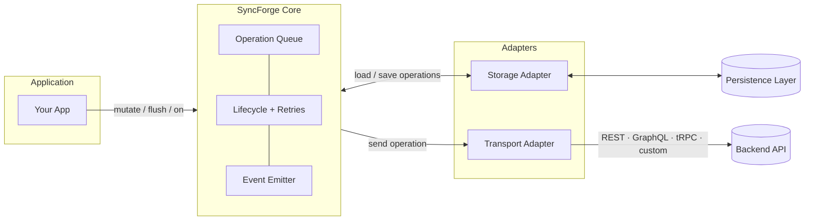
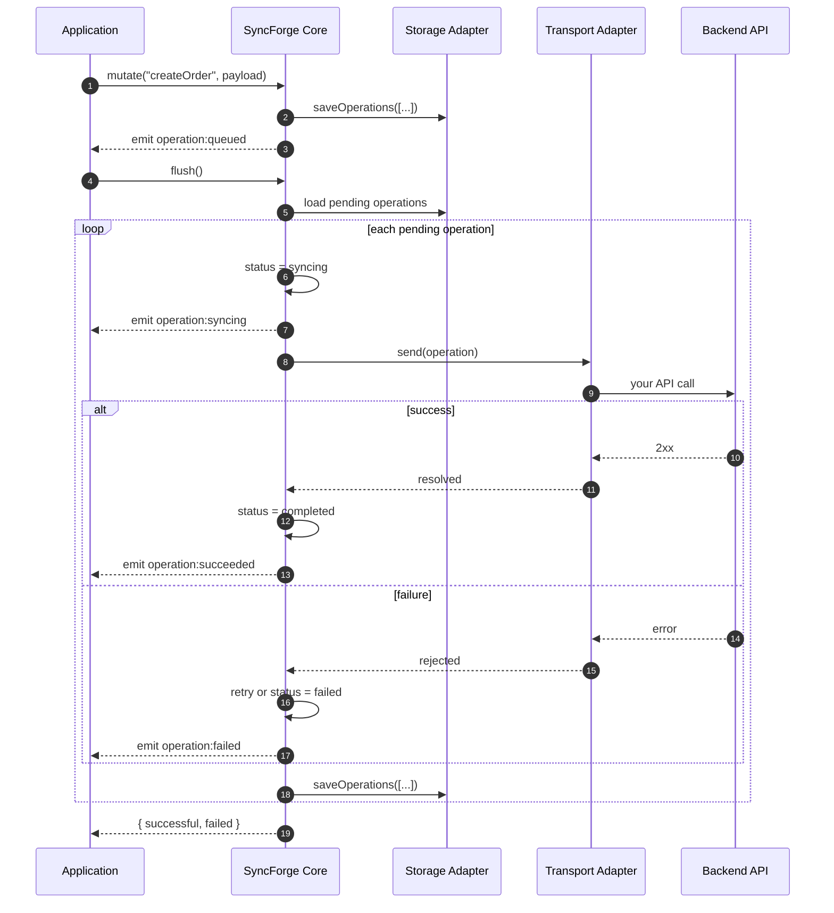
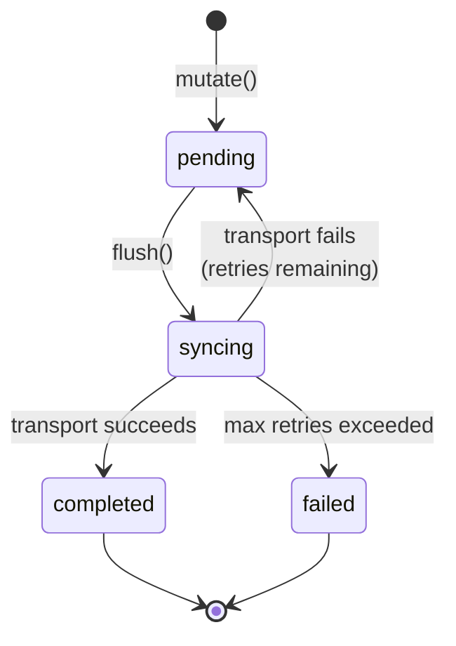

# SyncForge

**Don't lose user actions when the network drops.**

SyncForge aims to be the simplest way to guarantee mutation delivery in offline-capable applications without adopting a local database or replacing your existing API.

SyncForge is a small TypeScript library that saves changes locally when your app is offline or on a bad connection, then sends them to your server when you're back online. It works with any frontend framework and any backend — you bring your own API.

Maintained by Frank K. Abrokwa ([@codewithcobby](https://github.com/codewithcobby))

## Table of contents

- [Project status](./README.md#project-status)
- [Installation](./README.md#installation)
- [Quick start](./README.md#quick-start)
- [The problem](./README.md#the-problem)
- [What SyncForge does](./README.md#what-syncforge-does)
- [Architecture](./README.md#architecture)
- [How it works](./README.md#how-it-works)
- [Lifecycle events](./README.md#lifecycle-events)
- [Why use SyncForge?](./README.md#why-use-syncforge)
- [Why not X?](./README.md#why-not-x)
- [What SyncForge is not](./README.md#what-syncforge-is-not)
- [Roadmap](./README.md#roadmap)
- [License](./README.md#license)

## Project status

SyncForge is currently in **active development**.

| Status              | Details                                                                                  |
| ------------------- | ---------------------------------------------------------------------------------------- |
| Implemented         | Mutation queue, transport adapter, memory & IndexedDB storage, retries, lifecycle events |
| Tested              | Core engine behavior, flush integration, and IndexedDB persistence flows                 |
| Planned before v1.0 | Automatic reconnect sync, framework integrations                                         |

## Installation

```bash
pnpm add syncforge
```

```bash
npm install syncforge
```

```bash
yarn add syncforge
```

## Quick start

The first argument to `mutate()` is an **operation label** your app defines (e.g. `"createOrder"`). SyncForge stores it and passes the full operation to your transport on `flush()`. **Your transport** decides which API to call and how to map `operation.type` and `operation.payload`.

```typescript
import { createIndexedDbStorage, createSyncEngine } from "syncforge"

const transport = {
  async send(operation) {
    switch (operation.type) {
      case "createOrder":
        await fetch("/api/orders", {
          method: "POST",
          headers: { "Content-Type": "application/json" },
          body: JSON.stringify(operation.payload),
        })
        break
      default:
        throw new Error(`Unknown operation type: ${operation.type}`)
    }
  },
}

const sync = createSyncEngine({
  transport,
  storage: createIndexedDbStorage({ dbName: "my-app", storeName: "sync-queue" }),
})

await sync.mutate("createOrder", { customerId: "123", total: 100 })

const result = await sync.flush()
console.log(result) // { successful: 1, failed: 0 }
```

`createIndexedDbStorage()` is **browser-only** — it requires IndexedDB (not available in Node.js or SSR). Use `createMemoryStorage()` for tests, scripts, and server environments. Set a unique `dbName` per app on the same origin to avoid queue collisions.

### Node.js and tests

```typescript
import { createMemoryStorage, createSyncEngine } from "syncforge"

const sync = createSyncEngine({
  transport: myTransport,
  storage: createMemoryStorage(),
})
```

### Next.js example

In a client component or server action handler, queue a mutation and flush when the network is available:

```typescript
"use client"

import { createMemoryStorage, createSyncEngine } from "syncforge"

const sync = createSyncEngine({
  transport: {
    async send(operation) {
      switch (operation.type) {
        case "createOrder":
          await fetch("/api/orders", {
            method: "POST",
            headers: { "Content-Type": "application/json" },
            body: JSON.stringify(operation.payload),
          })
          break
        default:
          throw new Error(`Unknown operation type: ${operation.type}`)
      }
    },
  },
  storage: createMemoryStorage(),
})

export async function createOrder(total: number) {
  await sync.mutate("createOrder", { total })
  await sync.flush()
}
```

### Transport adapter examples

**Single endpoint** — post the full operation; your backend reads `operation.type`:

```typescript
class RestTransport {
  async send(operation) {
    await fetch("/api/mutations", {
      method: "POST",
      headers: { "Content-Type": "application/json" },
      body: JSON.stringify(operation),
    })
  }
}
```

**Routed endpoints** — map `operation.type` to the right API:

```typescript
class RoutedTransport {
  async send(operation) {
    const { type, payload } = operation

    switch (type) {
      case "createOrder":
        await fetch("/api/orders", {
          method: "POST",
          headers: { "Content-Type": "application/json" },
          body: JSON.stringify(payload),
        })
        break
      case "updateProfile":
        await fetch("/api/profile", {
          method: "PATCH",
          headers: { "Content-Type": "application/json" },
          body: JSON.stringify(payload),
        })
        break
      default:
        throw new Error(`Unknown operation type: ${type}`)
    }
  }
}
```

## The problem

Imagine a user filling out a form on a train, in a basement, or on spotty Wi‑Fi. They tap **Save**. The request fails. Their work is gone — or they have to try again manually.

Most apps either:

- Show an error and hope the user retries, or
- Bolt on complex state management that is hard to test and maintain

SyncForge gives you a dedicated layer for **"save now, sync later"** without turning your app into a database or a React-specific toolkit.

## What SyncForge does

1. **Records a change** — call `mutate(type, payload)`. `type` is your label; SyncForge does not interpret it.
2. **Stores it safely** — operations can be persisted through a storage adapter so they survive reloads and reconnects.
3. **Sends it when you are ready** — call `flush()`. Your transport receives each `SyncOperation` and decides how to call your API.
4. **Tells you what happened** — lifecycle events fire when operations are queued, syncing, succeeded, or failed.

You stay in control of **what** gets sent and **how**. SyncForge handles the **queue, persistence, and retry flow**.

## Architecture

SyncForge sits between your application and two pluggable adapters. The core owns the operation lifecycle; adapters own delivery and persistence.



| Layer                 | Responsibility                                                        |
| --------------------- | --------------------------------------------------------------------- |
| **Application**       | Calls `mutate()`, `flush()`, and subscribes to events                 |
| **SyncForge Core**    | Queues operations, tracks status, retries, and emits lifecycle events |
| **Transport Adapter** | Maps `operation.type` + `operation.payload` to your backend           |
| **Storage Adapter**   | Persists the operation queue across reloads                           |
| **Backend**           | Your existing API — SyncForge does not replace it                     |
| **Persistence**       | Memory and IndexedDB storage adapters; more adapters may follow       |

## How it works

### End-to-end flow



### Operation lifecycle



### API

| Method                  | Description                                                             |
| ----------------------- | ----------------------------------------------------------------------- |
| `mutate(type, payload)` | Enqueue a change (always safe to call)                                  |
| `flush()`               | Send pending operations via transport; returns `{ successful, failed }` |
| `getPending()`          | List operations still waiting to sync                                   |
| `on("operation:…")`     | React to queue and sync status in your UI                               |

### Behavior guarantees

- Concurrent `flush()` calls share one in-flight sync — operations are never sent twice.
- Mutations made during `flush()` are queued for the **next** flush, not the current one.
- After reload, operation `status`, `retries`, and `createdAt` are restored correctly.

## Lifecycle events

Use these to drive UI: spinners, toasts, "synced" badges, or error states.

```typescript
import { SyncEventTypes } from "syncforge"

sync.on(SyncEventTypes.Queued, ({ operation }) => {
  console.log("queued", operation.id)
})

sync.on(SyncEventTypes.Syncing, ({ operation }) => {
  console.log("syncing", operation.id)
})

sync.on(SyncEventTypes.Succeeded, ({ operation }) => {
  console.log("synced", operation.id)
})

sync.on(SyncEventTypes.Failed, ({ operation }) => {
  console.log("failed", operation.id)
})
```

## Why use SyncForge?

| You get                     | Why it matters                                                   |
| --------------------------- | ---------------------------------------------------------------- |
| **Offline-first by design** | User actions are captured even when the network is not available |
| **Framework-agnostic**      | Use with React, Vue, Svelte, or plain JavaScript                 |
| **Pluggable transport**     | Your API, your auth, your format — SyncForge does not care       |
| **Persistent queue**        | Operations survive reloads (with a storage adapter)              |
| **Observable lifecycle**    | Hook into events for UI, logging, or devtools later              |
| **Small surface area**      | Not a database, not a state manager, not a networking framework  |

**Good fit:** forms, carts, notes, field apps, or any flow where losing a mutation is worse than delaying it.

**Not a fit (yet):** full local-first databases, automatic background sync, or conflict resolution.

## Why not X?

### Why not React Query?

React Query focuses on server-state caching and request lifecycles. SyncForge focuses on guaranteed mutation delivery across unreliable networks. They work well together: React Query for reads and cache management, SyncForge for offline mutation durability.

### Why not PouchDB?

PouchDB is a local database with replication features. SyncForge is a focused mutation queue and sync engine. If you only need reliable mutation delivery with your existing API, SyncForge keeps the architecture simpler.

## What SyncForge is not

SyncForge core stays intentionally small:

- **Not** a database — it queues mutations, it does not replace your data layer
- **Not** a React library — no hooks or components in core (integrations may come later)
- **Not** a networking stack — you implement `TransportAdapter` for your API

That keeps the library easy to reason about and easy to adopt one piece at a time.

## Roadmap

- [x] Mutation queue
- [x] Memory storage adapter
- [x] IndexedDB storage adapter
- [x] Transport adapter
- [x] Lifecycle events
- [x] Retry strategy interface
- [ ] Automatic sync when back online
- [ ] Exponential and linear retry strategies
- [ ] Optimistic updates
- [ ] React integration

## License

MIT © [Frank K. Abrokwa](LICENSE)
